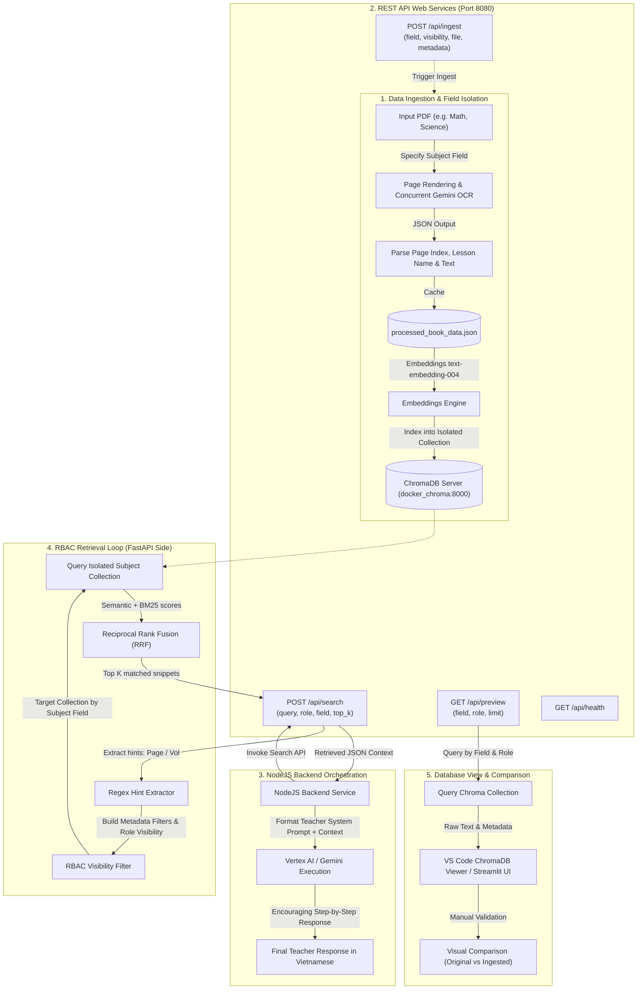

# AI Core Architecture & Implementation Specification

This document outlines the detailed system architecture design, data models, features, and input-to-output data processing workflows for the educational AI assistant.

---

## 1. System Architecture Diagram

The diagram below illustrates the offline data processing pipeline, the online REST API web endpoints, and the role-based retrieval loop:



---

## 2. Core Components & Isolation Design

The system implements strict separation of concerns to handle visually-intensive textbook layouts and fulfill access control policies:

### A. Field-Based Collection Isolation
*   To prevent cross-subject interference (e.g., math queries retrieving science formulas), documents are isolated at the **Collection level** in ChromaDB.
*   The subject name (passed as `field`) serves as a suffix for the collection name (e.g., `toan_3_curriculum_math`, `toan_3_curriculum_science`).
*   During ingestion and retrieval, the system connects only to the collection associated with the requested `field`.

### B. Role-Based Access Control (RBAC)
*   **Roles:** The system supports three standard roles: `student`, `teacher`, and `admin`.
*   **Visibility Levels:** Each page chunk in the Vector Database is tagged with a `visibility` metadata attribute:
    *   `public`: Accessible by all roles (`student`, `teacher`, `admin`).
    *   `teacher_only`: Accessible by `teacher` and `admin`.
    *   `admin_only`: Accessible only by `admin`.
*   **Retrieval Enforcement:** When querying the database, the user's role is mapped to allowed visibility levels:
    *   `student` -> `{"visibility": "public"}`
    *   `teacher` -> `{"$or": [{"visibility": "public"}, {"visibility": "teacher_only"}]}`
    *   `admin` -> No visibility filter (accesses all data).
*   This filtering is enforced at the database query level (`where` clause in ChromaDB) to guarantee that users cannot access vectors outside their authorized scope.

### C. Multimodal OCR & Caching
*   **DPI Rendering:** Uses `PyMuPDF` to convert PDF pages into PNG images at 150 DPI to ensure clear legibility for Gemini vision models.
*   **Gemini Vision OCR:** Sends rendered pages to `gemini-2.5-flash` with a prompt demanding physical page numbers, lesson names, and page markdown text in structured JSON format.
*   **Robust Rate-Limit Handling:** Utilizes a ThreadPoolExecutor with `max_workers=2` and an exponential backoff retry handler (sleeping 15s/30s/45s on `429 RESOURCE_EXHAUSTED` errors) to guarantee complete OCR extraction without empty pages.
*   **Caching:** Results are cached in `data/processed_book_data.json` to prevent duplicate API costs.

### E. Multi-Domain & Tag UUID Data Model (1:1 Ingestion to 1:N Retrieval)
*   **Single-UUID Document Ingestion:** Each ingested document (`POST /ingestion`) is tagged with **exactly 1 unique `tag_name_uuid`**. Every chunk generated from the document explicitly attaches `"tag_name_uuid": "uuid_x"` in its metadata.
*   **Multi-UUID Retrieval Routing:** When querying via `POST /retrieval`, a list of target UUIDs (`tag_name_uuids: ["uuid_1", "uuid_2", ...]`) is passed. The retrieval engine targets collections or chunks associated with ANY of the specified UUIDs in the array. Chunks belonging to UUIDs not present in the list are 100% excluded from the query scope.

---

## 3. System Features List

1.  **Multimodal OCR Pipeline:** Converts scanned image-only PDF pages into markdown text, extracting lesson headers and page numbers.
2.  **Subject Field Isolation:** Creates independent database collections per subject area to prevent data cross-contamination.
3.  **Role-Based Access Control:** Filters search results based on visibility tags (`public`, `teacher_only`, `admin_only`) mapped to user roles (`student`, `teacher`, `admin`).
4.  **Hybrid Dense-Sparse Search:** Combines vector embeddings (`text-embedding-004`) with keyword BM25 search.
5.  **Metadata Window Filter:** Extracts page and volume hints from query strings and restricts retrieval to neighboring pages.
6.  **FastAPI REST Web Service:** Exposes ingestion, search/RAG, preview, and health check endpoints.
7.  **Interactive CLI Search Tool:** Provides a terminal-based interface to verify database contents and query RAG retrieval directly.
8.  **Streamlit Web User Interface:** Exposes the RAG Search Explorer, document ingestion, vector DB preview, and health monitoring in a single web UI.
9.  **Vector DB Preview Utility:** Allows listing collection contents, enabling direct text and metadata comparison with original source PDFs.
10. **Google Cloud Vertex AI Authentication:** Supports authenticating natively via Service Account JSON credentials (`data/gcp-key.json`) mounted in Docker.
11. **Domain Management & Dual Collection Creation (`/create-domain`):** Dynamically provisions `{domain}_doc` (documents) and `{domain}_qa` (Q&A pairs) isolated collections.
12. **Multi-Domain & Date-Filtered Retrieval (`/retrieval`):** Routes queries across multiple domain UUIDs with content-type targeting (`doc` vs `qa`) and epoch numeric date-range filtering (`from_date` to `to_date`).
13. **Single-UUID Ingestion & Override/Update Modes (`/ingestion`):** Ingests PDF/QA documents with exact 1:1 `tag_name_uuid` metadata tagging, supporting `update` vs `override` deletion modes.
14. **Interactive Streamlit AI Chatbot & Chunk Visualizer:** Provides interactive pedagogical chat with Gemini AI reasoning, automatic textbook footnotes (`📖 Nguồn tham khảo`), and visual Chunk Separated Cards.

---

## 4. Input-to-Output Data Processing Workflows

### Workflow A: Document Ingestion (POST /api/ingest)
```
[User Request: File Path, Subject Field, Visibility Tag]
   │
   ├──> 1. Ingestion service loads PDF file from path.
   │
   ├──> 2. PDFBookParser renders pages to PNG images.
   │
   ├──> 3. Concurrent Gemini Multimodal OCR parses images to JSON (Lesson Name, Physical Page, Text).
   │      └──> [Rate limit 429 occurs? Sleep for 15s * attempt and retry up to 5 times].
   │
   ├──> 4. OCR results are saved into `data/processed_book_data.json` cache.
   │
   ├──> 5. Text content is embedded via Vertex AI `text-embedding-004` (embeddings extraction).
   │
   └──> 6. Records are upserted into ChromaDB collection `toan_3_curriculum_{field}`.
          └──> Metadata includes: `volume`, `physical_page`, `pdf_page_index`, `lesson_name`, `visibility`.
```

### Workflow B: RAG Search & Retrieval (POST /api/search)
```
[User Input: Query String, User Role, Subject Field, parameters]
   │
   ├──> 1. NodeJS Backend (or direct client) invokes FastAPI `/api/search` POST endpoint.
   │
   ├──> 2. Search Engine receives parameters and extracts page and volume hints via regex.
   │
   ├──> 3. Restricted to the isolated ChromaDB collection corresponding to the `field`.
   │
   ├──> 4. Builds search filters combining page window matching and RBAC user role permissions.
   │
   ├──> 5. Query results from Vector Search and BM25 Okapi are fused via Reciprocal Rank Fusion (RRF).
   │
   └──> 6. Returns a structured JSON list of matching records (ID, raw text, and metadata).
          └──> Used by the NodeJS backend to construct context for final LLM teacher generation.
```

### Workflow C: DB Preview & Validation (GET /api/preview)
```
[User Request: Subject Field, User Role, limit]
   │
   ├──> 1. API identifies ChromaDB collection associated with the `field`.
   │
   ├──> 2. Builds query filter to restrict results to the user's `role` permissions.
   │
   ├──> 3. Calls `collection.get()` with limits to retrieve raw text and metadata.
   │
   └──> 4. Returns JSON list of records (id, physical_page, lesson_name, text snippet).
          └──> Used by developers in VS Code ChromaDB Viewer to verify OCR accuracy.
```

### Workflow D: Multi-Domain & Date-Filtered Retrieval (POST /retrieval)
```
[User Input: text, tag_name_uuids[], type ("doc"|"qa"), from_date, to_date, user_role, user_id, user_groups]
   │
   ├──> 1. FastAPI `/retrieval` parses dates into numeric epoch timestamps (`created_at_timestamp`).
   │
   ├──> 2. Iterates over each UUID in `tag_name_uuids`.
   │      ├──> Dedicated Collection `{uuid}_{type}` exists? Query it directly.
   │      └──> Otherwise: Query shared `_{type}` collections with metadata filter `{"$or": [{"file_id": uuid}, {"tag_name_uuid": uuid}]}`.
   │
   ├──> 3. Applies $gte and $lte date filters on `created_at_timestamp` + ACL RBAC ($or clause).
   │
   ├──> 4. Merges candidate chunks across collections and sorts by similarity distance score.
   │
   └──> 5. Returns structured JSON containing array of matching chunks (id, collection, text, distance, metadata).
```

### Workflow E: Interactive Streamlit Chatbot & Citation Generation
```
[User Chat Input -> Streamlit Web UI]
   │
   ├──> 1. Streamlit invokes `multi_domain_retrieval` with user query and active field.
   │
   ├──> 2. Formats retrieved chunks into RAG Context + explicitly builds Citation Lines (`Trang X`, `file_name`).
   │
   ├──> 3. Sends prompt + RAG Context to Gemini 2.5 Flash API for pedagogical reasoning.
   │
   └──> 4. Renders streaming response in Chatbot UI (`st.chat_message`) with footnotes:
          └──> 📖 Nguồn tham khảo: - Tài liệu: file.pdf | Bài học: Lesson | Vị trí: Trang 15 (Tập 1)
```

---

## 5. PostgreSQL & pgvector Integration (Production Target)

To scale the system beyond development collections, the database schema supports deploying on a relational **PostgreSQL** instance equipped with the **`pgvector`** extension.

### A. Core Relational Schema
The database schema defined in [stem.db](file:///d:/Project%20Local/OCR-STEM/data/postgresql/stem.db) manages:
- **Multitenant Organizations (`organizations`, `users`)**: Guarantees complete data separation between different educational or business entities.
- **RBAC Roles & Groups (`roles`, `user_roles`, `groups`, `group_members`)**: Manages structural user scopes.
- **Document Chunk Registry (`documents`, `document_chunks`)**: Couples document ownership to vector chunks containing 768-dimensional embeddings (`vector(768)`).
- **Fine-Grained Permissions (`document_permissions`)**: Maps explicit access control list (ACL) exceptions for documents to specific users, groups, or roles.

### B. High-Performance HNSW Vector Query
To search vector embeddings while strictly filtering by multitenant constraints and role visibility, the search engine joins chunks with parent documents and filters dynamically.
The vector index is built using the HNSW algorithm with Cosine similarity:
```sql
CREATE INDEX idx_document_chunks_embedding ON document_chunks USING hnsw (embedding vector_cosine_ops);
```
During retrieval, a unified SQL query extracts the top relevant pages, ensuring that unauthorized users cannot retrieve vectors outside their access scope. Detailed schema documentation is maintained in [README.md](file:///d:/Project%20Local/OCR-STEM/data/postgresql/README.md).
