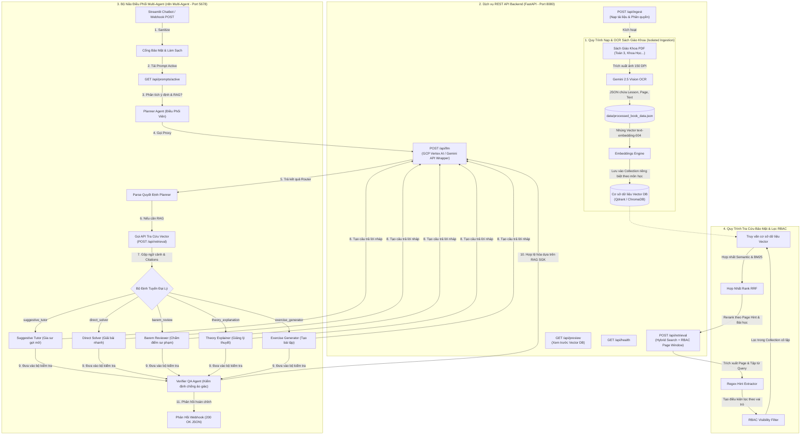

# TÀI LIỆU KIẾN TRÚC HỆ THỐNG MINI-LMS
## Hệ Thống Trợ Lý Giáo Dục Multi-Agent (Multi-Agent RAG System) Giải Quyết 3 Thách Thức Sư Phạm Cốt Lõi

Tài liệu này mô tả chi tiết kiến trúc hệ thống, mô hình dữ liệu và quy trình xử lý dữ liệu của nền tảng LMS Mini tích hợp trí tuệ nhân tạo (AI Orchestrator) giúp cá nhân hóa giáo dục tiểu học.

---

## 1. TỔNG QUAN KIẾN TRÚC HỆ THỐNG (SYSTEM OVERVIEW)

Hệ thống được thiết kế theo kiến trúc **Decoupled RAG & Multi-Agent Orchestration**, tách biệt hoàn toàn giữa:
1. **Dịch vụ lưu trữ và truy xuất vector (FastAPI Side):** Đảm nhiệm vai trò chạy OCR Multimodal, sinh vector embeddings, và lọc quyền truy cập dữ liệu ở mức độ thấp (RBAC Filter) sử dụng cơ chế Hybrid Search (Dense Embeddings + Sparse BM25).
2. **Bộ não điều phối Agent (n8n Multi-Agent Orchestration):** Sử dụng n8n để kéo thả trực quan các mối quan hệ giữa các Agent chuyên gia sư phạm (Planner, Tutor, Solver, Reviewer, Verifier), giúp linh hoạt thay đổi logic giảng dạy mà không cần thay đổi mã nguồn backend.
3. **Giao diện kiểm thử và trải nghiệm người dùng (Streamlit Frontend):** Cổng kết nối tương tác trực quan cho Học sinh, Giáo viên và Quản trị viên.

### Sơ đồ kiến trúc Mermaid (System Dataflow)

---

## 2. PHÂN TÍCH THIẾT KẾ CÁCH LY & PHÂN QUYỀN TRUY CẬP (RBAC & ISOLATION)

Để đảm bảo nền tảng LMS hoạt động chính xác trong môi trường học đường thực tế, hệ thống áp dụng các tiêu chuẩn thiết kế bảo mật nghiêm ngặt sau:

### A. Cách ly môn học mức độ Collection (Subject Field Isolation)
* Để tránh hiện tượng "nhiễu kiến thức" giữa các môn học (ví dụ: học sinh đang hỏi bài toán đố lại truy xuất nhầm công thức khoa học vật lý), dữ liệu được cách ly hoàn toàn ở mức độ Collection vật lý trong Vector DB.
* Collection được đặt tên theo định dạng: `{subject_field}_doc` và `{subject_field}_qa`.
* Khi truy xuất dữ liệu, API FastAPI chỉ hướng truy vấn vào đúng Collection của môn học được yêu cầu thông qua tham số `tag_name_uuids`.

### B. Phân quyền người học mức độ mịn (Role-Based Access Control - RBAC)
Hệ thống lưu trữ phân chia người dùng thành 3 vai trò có quyền truy cập tăng dần:
1. **Học sinh (`student`):** Chỉ được phép truy xuất các tài liệu có nhãn `visibility = "public"`.
2. **Giáo viên (`teacher`):** Được truy xuất tài liệu `public` và các tài liệu nghiệp vụ sư phạm `visibility = "teacher_only"` (ví dụ: giáo án, tài liệu hướng dẫn giảng dạy chuyên sâu).
3. **Quản trị viên (`admin`):** Được quyền truy xuất toàn bộ tài liệu trong Vector DB, bao gồm cả nhãn `visibility = "admin_only"`.

Cơ chế lọc quyền được thực thi **ngay tại tầng truy vấn của Vector DB** bằng cách chèn điều kiện lọc metadata (`where` clause) thay vì lọc sau khi lấy dữ liệu (post-filtering), đảm bảo an toàn tuyệt đối về bảo mật thông tin.

---

## 3. GIẢI PHÁP GIẢI QUYẾT 3 BÀI TOÁN SƯ PHẠM CỐT LÕI

Kiến trúc AI Agent (Multi-Agent) trong hệ thống giải quyết triệt để các bài toán thực tiễn của một lớp học như sau:

### Bài toán 1: Đáp ứng 3 nhóm học viên khác biệt (Xuất sắc - Trung bình - Cần hỗ trợ)
*   *Đặc thù thực thi thực tế (Tính trung thực và đơn giản):* Cần làm rõ rằng trong phiên bản hiện tại, hệ thống **chưa tích hợp cơ chế tự động hồ sơ hóa cá nhân (personalization profile mapping)** tự động phân loại học sinh vào các nhóm cố định trong cơ sở dữ liệu. 
*   *Phương thức giải quyết:* Để giải quyết bài toán phục vụ 3 nhóm đối tượng học sinh một cách đơn giản, ổn định và hiệu quả nhất, hệ thống cung cấp **đa dạng các chế độ học tập (Pedagogical Modalities)** dưới dạng các Agent chuyên gia riêng biệt. Tất cả các Agent này đều hỗ trợ và mở rộng cho **cả 3 nhóm học sinh** tùy chọn sử dụng tùy theo trạng thái học tập tức thời của họ.
*   *Cơ chế điều phối (Intent Routing):* **Planner Agent** đóng vai trò phân loại ý định (Intent Classifier) trực tiếp từ câu hỏi/yêu cầu của người dùng để định tuyến đến Agent chuyên gia phù hợp:
    *   **Mô-đun Gia sư Gợi mở (`suggestive_tutor` Agent):** Thực thi phương pháp sư phạm gợi ý từng bước (Socratic Method), chỉ đưa ra câu hỏi hướng dẫn bước nhỏ đầu tiên mà không cho đáp số trực tiếp. Bất kỳ học viên nào (đặc biệt là nhóm Cần hỗ trợ khi gặp bài toán khó) đều có thể chủ động kích hoạt chế độ này để được dắt tay học tập từng bước mà không lo sợ rụt rè hay bỏ cuộc trước bài tập khó.
    *   **Mô-đun Biên soạn Bài tập (`exercise_generator` Agent):** Tự động biên soạn bộ đề luyện tập 3 cấp độ (Nhận biết, Vận dụng, Vận dụng cao) dựa trên RAG SGK, ẩn lời giải chi tiết dưới thẻ HTML `
`. Chế độ này giúp học sinh (đặc biệt là nhóm Xuất sắc) chủ động tự ôn tập, thử thách tư duy với các bài toán nâng cao để tránh cảm giác nhàm chán khi học chương trình đại trà.
    *   **Mô-đun Giải thích Lý thuyết (`theory_explanation` Agent):** Diễn giải trực quan các khái niệm lý thuyết cốt lõi bằng ví dụ thực tế gần gũi sinh động (chia bánh, xếp thuyền giấy). Bất kỳ học sinh nào (đặc biệt là nhóm Trung bình đang muốn lấp đầy lỗ hổng tư duy khái niệm) đều có thể sử dụng chế độ này để nắm vững bản chất học thuật và bứt phá.

### ️ Bài toán 2: Chấm bài tự luận nhất quán, công bằng, minh bạch
Để loại bỏ sự cảm tính và thiếu nhất quán khi chấm các bài viết, bài giải tự luận của học sinh, hệ thống thiết lập quy trình **Hai Bước Duyệt Nghiêm Ngặt**:
1. **Bước 1 - Chấm Điểm Thô (`barem_review` Expert Agent):** AI tiếp nhận Đề bài, Bài làm của học sinh, và Barem điểm chuẩn (Rubrics). Nó tiến hành so sánh từng dòng lập luận, phép toán của học sinh với barem, lập bảng chấm điểm chi tiết từng phần, chỉ rõ học sinh làm đúng đến bước nào và được cộng bao nhiêu điểm.
2. **Bước 2 - Kiểm Định Chất Lượng (`verifier_barem_review` Quality Control Agent):** Phản hồi chấm điểm nháp được gửi qua Verifier Agent để rà soát lỗi tính điểm, kiểm tra tính thực tế và giọng điệu sư phạm trước khi trả về học sinh. Định dạng đầu ra bắt buộc dưới dạng bảng markdown rõ ràng, giúp phụ huynh và học sinh dễ dàng đối chiếu, tạo niềm tin về sự công bằng, minh bạch tuyệt đối.

### Bài toán 3: Theo dõi quá trình học và Chẩn đoán hổng kiến thức theo thời gian
Trong phân hệ **Mentor Studio** kết hợp với luồng n8n workflow, hệ thống tích hợp công cụ chẩn đoán tự động:
* Mỗi lượt nộp bài làm của học sinh sẽ được lưu vết và tổng hợp điểm số.
* **Chẩn đoán chủ đề yếu (`Weak Topics Diagnostics`):** Khi học sinh làm sai ở các câu hỏi tự luận hay trắc nghiệm, Agent sẽ đối chiếu kết quả với các tiêu chuẩn kiến thức trong SGK để xác định chính xác phần kiến thức rỗng (ví dụ: học sinh làm sai phép nhân do quên nhớ, hoặc tính sai chu vi vì nhầm công thức diện tích).
* **Đề xuất lộ trình khắc phục (`Personalized Learning Recommendation`):** Hệ thống tự động biên soạn một báo cáo chẩn đoán học tập kèm theo mức độ nghiêm trọng (Thấp - Trung bình - Cao), đưa ra lời khuyên cá nhân hóa về nội dung cần ôn tập lại ngay lập tức để học sinh tiến bộ vững chắc nhất.

---

## 4. QUY TRÌNH HỢP LỆ HÓA DỮ LIỆU CHỐNG ẢO GIÁC (QA VERIFIER GATE)

Để đảm bảo câu trả lời của AI luôn luôn bám sát theo nội dung chương trình học của Bộ Giáo dục và Đào tạo (chống ảo giác học thuật - hallucination):
* Toàn bộ câu trả lời nháp từ các Agent chuyên gia đều bắt buộc phải đi qua **Verifier Agent** trước khi trả về cổng Webhook.
* Verifier Agent thực hiện so khớp chéo nội dung nháp với **Văn bản gốc từ RAG Context** được truy xuất.
* **Quy tắc nghiêm ngặt:** Nếu phát hiện câu trả lời nháp chứa các số liệu, kiến thức hay cách giải sai lệch hoặc không có trong ngữ cảnh tài liệu gốc được cung cấp, Verifier Agent sẽ tự động hiệu chỉnh lại (`CORRECTED`) hoặc hạ cấp câu trả lời về thông báo mặc định thân thiện để bảo vệ tính chính xác học thuật cao nhất.

---
