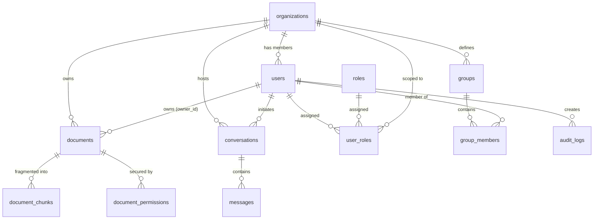

# STEM Database Documentation & RAG/RBAC Schema Specification

This document provides a detailed overview of the PostgreSQL relational schema designed for managing **Organizations, Users, Groups, Documents, Vector Embeddings (RAG), Permissions (RBAC)**, and **Conversations**.

The SQL definition is located in [stem.db](file:///d:/Project%20Local/OCR-STEM/data/postgresql/stem.db).

---

## 1. Database Entity-Relationship Overview



---

## 2. Table Specifications & Definitions

### A. Organizations & Users (Multitenancy)
*   **`organizations`**: Houses enterprise/educational tenants. Allows complete multitenancy isolation.
*   **`users`**: User profile information, including encrypted password hashes, organization references, and lifecycle statuses.

### B. Access Control (RBAC & Groups)
*   **`roles`**: System roles (e.g. `student`, `teacher`, `admin`).
*   **`user_roles`**: Many-to-many lookup mapping a user to a specific role, scoped to an organization.
*   **`groups`**: Logical user groups (e.g. departments, classrooms, or teams).
*   **`group_members`**: Group membership matching users to groups.

### C. Documents & Vector Retrieval (RAG Chunks)
*   **`documents`**: Parent metadata table for uploaded items (PDFs, docx, etc.), detailing ownership and visibility scopes.
*   **`document_chunks`**: Fragmented sections of document text. 
    *   Contains the `embedding` column of type `VECTOR(768)` (for Gemini `text-embedding-004`).
    *   Indexed using **HNSW (Hierarchical Navigable Small World)** with Cosine similarity distance operator (`vector_cosine_ops`), enabling high-performance sub-millisecond semantic search.
    *   Tracks `page_number` for metadata window filtering.

### D. Security & Permissions (RBAC Visibility)
*   **`document_permissions`**: Granular access control overrides. Map explicit read/write privileges for a document to a specific user, group, or role.
*   **Permissions Resolution Flow:**
    1.  If the document's `visibility_scope` is `public`, any user in the organization can read it.
    2.  If the `visibility_scope` is `teacher_only`, users with the role `teacher` or `admin` can read it.
    3.  If `private`, the query checks if the user is the `owner_id` or if a record exists in `document_permissions` granting access to the `user_id`, or one of their `group_id`s, or their `role_id`.

### E. Conversations & Message History
*   **`conversations`**: Chat sessions tied to users and organizations. Can optionally be scoped to a single document (`scope_document_id`).
*   **`messages`**: History of messages within a conversation. Stores citations as `JSONB` arrays matching source page metadata and chunk UUIDs.

---

## 3. High-Performance RAG & Security SQL Query Example

The following query illustrates how a RAG vector search retrieves the top 5 relevant document chunks for a specific user (e.g. a `student`) while enforcing both **multitenancy**, **RBAC visibility scopes**, and **group permissions**:

```sql
SELECT 
    dc.id AS chunk_id,
    dc.page_number,
    d.title AS document_title,
    dc.content_text,
    (dc.embedding <=> :query_embedding) AS distance -- Cosine distance calculation
FROM document_chunks dc
JOIN documents d ON dc.document_id = d.id
WHERE 
    -- 1. Tenant Isolation
    d.org_id = :current_user_org_id 
    
    -- 2. Security Filters
    AND (
        -- Owner has full access
        d.owner_id = :current_user_id 
        
        -- Scope: Public access
        OR d.visibility_scope = 'public'
        
        -- Scope: Teacher-only access (for authorized roles)
        OR (d.visibility_scope = 'teacher_only' AND :current_user_role IN ('teacher', 'admin'))
        
        -- Overrides: Explicit grant via document_permissions
        OR EXISTS (
            SELECT 1 
            FROM document_permissions dp
            WHERE dp.document_id = d.id
              AND dp.permission IN ('read', 'write', 'admin')
              AND (dp.expires_at IS NULL OR dp.expires_at > CURRENT_TIMESTAMP)
              AND (
                  (dp.principal_type = 'user' AND dp.principal_id = :current_user_id)
                  OR (dp.principal_type = 'role' AND dp.principal_id = :current_user_role_id)
                  OR (dp.principal_type = 'group' AND dp.principal_id IN (
                      SELECT group_id FROM group_members WHERE user_id = :current_user_id
                  ))
              )
        )
    )
ORDER BY distance ASC
LIMIT 5;
```
