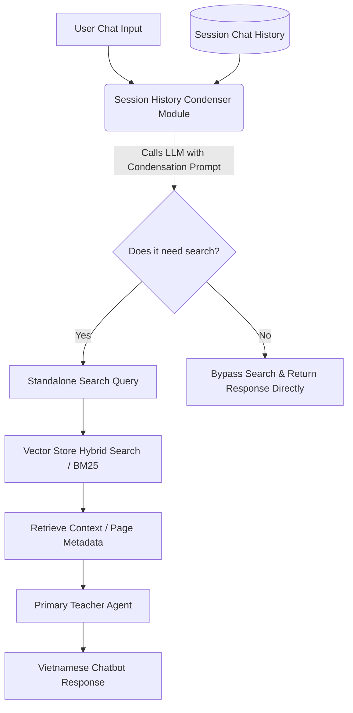
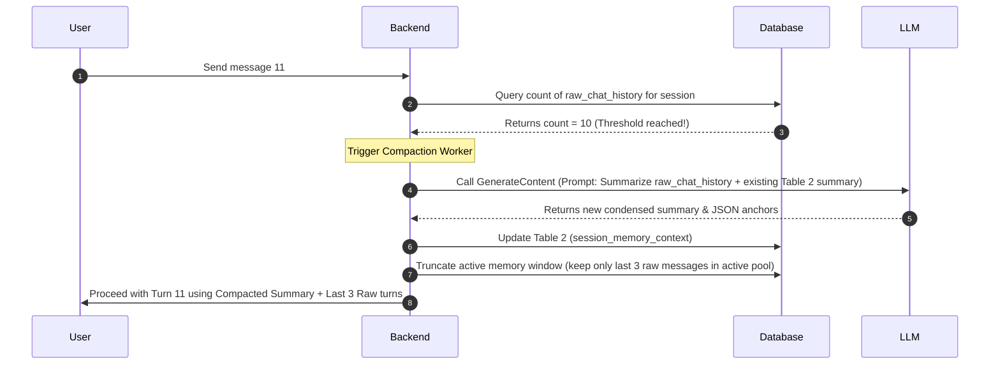

# Conversational Query Condensation Guide

This guide documents the technical design, system prompt, input/output structures, and code implementations for the **Session History Condenser** module. 

In a Conversational RAG (Retrieval-Augmented Generation) system, users frequently ask follow-up questions containing coreferences or elliptical phrases (e.g., *"Giải giúp mình bài đó với"*, *"Trang này có bài tập nào không?"*, *"Ví dụ khác"*). The Condenser module rewrites the chat history and the latest user prompt into a single, self-contained standalone search query that can be queried against the vector database.

---

## 1. Architectural Flow

The following diagram illustrates how the Session History Condenser sits between the user chat interface and the primary vector retrieval pipeline:



---

## 2. System Instructions & Prompt

The model must be instructed to act as a linguistic analyzer. Its sole responsibility is to extract context and construct a clear, standalone search query in **Vietnamese**.

### System Prompt (Vietnamese)
```markdown
Bạn là một trợ lý phân tích ngôn ngữ chuyên nghiệp cho hệ thống Giáo dục RAG.
Nhiệm vụ của bạn là nhận vào:
1. Lịch sử cuộc trò chuyện giữa Người dùng (User) và Trợ lý (Assistant).
2. Câu hỏi mới nhất của Người dùng (Latest Message).

Hãy phân tích và viết lại Câu hỏi mới nhất thành một câu truy vấn độc lập, rõ ràng bằng tiếng Việt (Standalone Query) dùng để tìm kiếm tài liệu trong sách giáo khoa.

### QUY TẮC PHÂN TÍCH:
1. **Giải quyết đại từ chỉ trỏ (Coreference Resolution):** Tìm các từ thay thế như "bài đó", "bài này", "nó", "trang trên", "phần trước" trong câu hỏi mới nhất và thay thế chúng bằng thông tin thực tế từ lịch sử cuộc trò chuyện (ví dụ: "bài 3", "trang 24", "tập 1").
2. **Bảo toàn ngữ cảnh địa lý sách (Location context):** Nếu lịch sử có đề cập đến một trang cụ thể (ví dụ: Trang 15) hoặc tập cụ thể (Tập 1 hoặc Tập 2), hãy gộp thông tin trang và tập này vào câu truy vấn độc lập để lọc chính xác.
3. **Phân loại nhu cầu tìm kiếm (Search Intent Classify):**
   - Đặt `needs_search = true` nếu câu hỏi hỏi về bài tập, định nghĩa, kiến thức học tập, hoặc yêu cầu giải bài tập trong sách giáo khoa.
   - Đặt `needs_search = false` nếu câu hỏi chỉ là chào hỏi xã giao (ví dụ: "Chào bạn", "Tạm biệt"), câu hỏi phi toán học, hoặc lời cảm ơn đơn thuần (ví dụ: "Cảm ơn bạn").
4. **Không trả lời câu hỏi:** Tuyệt đối KHÔNG trả lời câu hỏi của người dùng. Bạn chỉ đang viết lại câu truy vấn tìm kiếm.
5. **Đầu ra bắt buộc:** Trả về định dạng JSON đúng cấu trúc được mô tả bên dưới.
```

---

## 3. Request & Response Specification

### Input Parameters
* `latest_message` (String, Required): The raw new input text sent by the user.
* `chat_history` (Array of Message Objects, Optional): The list of prior messages in the current session.
  * `role` (String): Either `"user"` or `"model"`.
  * `content` (String): The text content of the message.

### Output JSON Schema
The output from the module must strictly follow this JSON format:
```json
{
  "type": "object",
  "properties": {
    "standalone_query": {
      "type": "string",
      "description": "The rewritten, self-contained query in Vietnamese containing all resolved page/volume contexts."
    },
    "needs_search": {
      "type": "boolean",
      "description": "True if the query requires database search/retrieval; False if it is a greeting, farewell, or off-topic conversational text."
    },
    "context_summary": {
      "type": "string",
      "description": "A short summary of current session anchors, e.g., 'Trang 24, Tập 1'."
    }
  },
  "required": ["standalone_query", "needs_search", "context_summary"]
}
```

---

## 4. Execution Examples

### Example 1: Resolving Pronouns and Page References
* **Chat History:**
  ```json
  [
    { "role": "user", "content": "Tìm cho mình bài tập về hình tam giác ở trang 45 tập 2" },
    { "role": "model", "content": "Dưới đây là nội dung Bài 2 và Bài 3 trang 45 sách giáo khoa Toán 3 Tập 2..." }
  ]
  ```
* **Latest Message:** `"Giải thích cho mình bài số 2 đi"`
* **Expected Output JSON:**
  ```json
  {
    "standalone_query": "Giải thích chi tiết bài tập 2 về hình tam giác trang 45 sách giáo khoa Toán lớp 3 tập 2",
    "needs_search": true,
    "context_summary": "Trang 45, Tập 2, Bài tập hình tam giác"
  }
  ```

### Example 2: Greeting & Off-topic (No Search Needed)
* **Chat History:** `[]`
* **Latest Message:** `"Chào bạn, bạn có khỏe không?"`
* **Expected Output JSON:**
  ```json
  {
    "standalone_query": "Chào bạn, bạn có khỏe không?",
    "needs_search": false,
    "context_summary": "Greeting"
  }
  ```

### Example 3: Context Retention across Multiple Turns
* **Chat History:**
  ```json
  [
    { "role": "user", "content": "Sách Toán tập 1 có bài nào về phép chia hết không?" },
    { "role": "model", "content": "Có bài 'Phép chia hết và phép chia có dư' ở trang 64 Tập 1..." },
    { "role": "user", "content": "Cho mình xem các bài luyện tập ở trang đó" },
    { "role": "model", "content": "Các bài luyện tập trang 64 bao gồm..." }
  ]
  ```
* **Latest Message:** `"Giải bài 1 phần b"`
* **Expected Output JSON:**
  ```json
  {
    "standalone_query": "Giải bài tập 1 phần b trang 64 sách giáo khoa Toán lớp 3 tập 1 về phép chia hết",
    "needs_search": true,
    "context_summary": "Trang 64, Tập 1, Phép chia hết"
  }
  ```

---

## 5. Developer Implementation

Here are reference implementations for python and Node.js using the official Google GenAI SDK.

### Node.js Implementation (`gemini-2.5-flash`)

Ensure you have `@google/genai` installed:
```bash
npm install @google/genai
```

```javascript
import { GoogleGenAI, Type } from '@google/genai';

const ai = new GoogleGenAI({});

async function condenseSessionHistory(latestMessage, chatHistory = []) {
  const systemInstruction = `
Bạn là một trợ lý phân tích ngôn ngữ chuyên nghiệp cho hệ thống Giáo dục RAG.
Nhiệm vụ của bạn là nhận vào lịch sử cuộc trò chuyện và câu hỏi mới nhất của người dùng.
Hãy viết lại câu hỏi đó thành một câu truy vấn tìm kiếm tiếng Việt độc lập (Standalone Query) chứa đầy đủ ngữ cảnh trang sách, chương, tập được nhắc tới trong lịch sử.

Tuyệt đối không tự trả lời câu hỏi của người dùng.
  `.trim();

  // Format the history & latest message as user prompt
  const formattedPrompt = `
LỊCH SỬ CHAT:
${chatHistory.map(msg => `- ${msg.role === 'user' ? 'Người dùng' : 'Trợ lý'}: ${msg.content}`).join('\n')}

CÂU HỎI MỚI NHẤT:
${latestMessage}
  `.trim();

  try {
    const response = await ai.models.generateContent({
      model: 'gemini-2.5-flash',
      contents: formattedPrompt,
      config: {
        systemInstruction: systemInstruction,
        temperature: 0.1,
        // Enforce Structured JSON Output
        responseMimeType: 'application/json',
        responseSchema: {
          type: Type.OBJECT,
          properties: {
            standalone_query: { 
              type: Type.STRING, 
              description: 'Câu truy vấn tiếng Việt độc lập chứa đầy đủ ngữ cảnh đã giải quyết.' 
            },
            needs_search: { 
              type: Type.BOOLEAN, 
              description: 'True nếu câu hỏi cần truy vấn DB; False nếu là lời chào xã giao.' 
            },
            context_summary: { 
              type: Type.STRING, 
              description: 'Tóm tắt ngắn gọn ngữ cảnh trang/tập hiện tại.' 
            }
          },
          required: ['standalone_query', 'needs_search', 'context_summary']
        }
      }
    });

    const result = JSON.parse(response.text);
    return result;
  } catch (error) {
    console.error('Error during history condensation:', error);
    // Fallback safely to original message
    return {
      standalone_query: latestMessage,
      needs_search: true,
      context_summary: 'Fallback'
    };
  }
}
```

### Python Implementation (`gemini-2.5-flash`)

Ensure you have `google-genai` installed:
```bash
pip install google-genai pydantic
```

```python
from google import genai
from google.genai import types
from pydantic import BaseModel, Field

class CondensationOutput(BaseModel):
    standalone_query: str = Field(description="Câu truy vấn tiếng Việt độc lập chứa ngữ cảnh đã giải quyết.")
    needs_search: bool = Field(description="True nếu cần tra cứu sách khoa; False nếu là xã giao/chào hỏi.")
    context_summary: str = Field(description="Tóm tắt ngắn gọn ngữ cảnh trang/tập sách hiện tại.")

def condense_session_history(latest_message: str, chat_history: list = []) -> CondensationOutput:
    client = genai.Client()
    
    system_instruction = (
        "Bạn là một trợ lý phân tích ngôn ngữ cho hệ thống Giáo dục RAG.\n"
        "Nhận vào lịch sử chat và câu hỏi mới nhất, viết lại câu hỏi thành một câu truy vấn tìm kiếm tiếng Việt "
        "độc lập chứa đầy đủ ngữ cảnh địa lý trang sách từ lịch sử. Không trả lời câu hỏi."
    )
    
    # Format conversational context
    history_lines = []
    for msg in chat_history:
        role = "Người dùng" if msg.get("role") == "user" else "Trợ lý"
        history_lines.append(f"- {role}: {msg.get('content')}")
        
    formatted_prompt = f"LỊCH SỬ CHAT:\n" + "\n".join(history_lines) + f"\n\nCÂU HỎI MỚI NHẤT:\n{latest_message}"
    
    try:
        response = client.models.generate_content(
            model='gemini-2.5-flash',
            contents=formatted_prompt,
            config=types.GenerateContentConfig(
                system_instruction=system_instruction,
                temperature=0.1,
                response_mime_type="application/json",
                response_schema=CondensationOutput
            )
        )
        return CondensationOutput.model_validate_json(response.text)
    except Exception as e:
        print(f"Error during condensation: {e}")
        return CondensationOutput(
            standalone_query=latest_message,
            needs_search=True,
            context_summary="Fallback"
        )
```

---

## 6. Advanced Architecture: Dual-Table Windowed Memory with Summarization

To scale long-running sessions, feeding the entire raw chat history into the LLM at every turn becomes expensive, slow, and can lead to context pollution. An industry best-practice is to use a **Dual-Table sliding window memory structure** with periodic history compaction.

### Database Design

#### Table 1: `raw_chat_history` (Full UI Audit Trail)
Stores every raw message exchanged. This table is used purely to render the chat UI for the user.

| Field Name | Type | Description |
| :--- | :--- | :--- |
| `id` | UUID (PK) | Unique message identifier. |
| `session_id` | String (Index) | Identifies the unique chat session. |
| `role` | String | `'user'` or `'assistant'`. |
| `content` | String | The raw, original message text. |
| `created_at` | Timestamp | Order of the message. |

#### Table 2: `session_memory_context` (Active Condensed Context)
Stores the summarized history of the session. It is updated periodically (e.g., every 10 turns) by a background worker.

| Field Name | Type | Description |
| :--- | :--- | :--- |
| `session_id` | String (PK) | Unique chat session. |
| `summary` | String | A high-level bulleted summary of key topics and concepts discussed. |
| `current_anchors` | JSON | Key metadata anchors resolved (e.g., `{"page": 24, "volume": 1, "topic": "geometry"}`). |
| `last_compacted_at`| Timestamp | Timestamp of the last compaction run. |

---

### Step-by-Step Compaction Workflow



### Prompt for History Compaction
When the message threshold is reached, call the LLM with this instruction to compile the summary:

```markdown
Bạn là một trợ lý tóm tắt và quản lý ngữ cảnh trò chuyện.
Nhiệm vụ của bạn là đọc:
1. Bản tóm tắt cũ của cuộc trò chuyện (nếu có).
2. Lịch sử các tin nhắn hội thoại mới phát sinh trong phiên.

Hãy tổng hợp và tạo ra một bản tóm tắt mới ngắn gọn (dạng danh sách gạch đầu dòng) ghi nhận:
- Chủ đề, nội dung đang được trao đổi (ví dụ: bài tập, khái niệm, câu hỏi).
- Các dữ kiện quan trọng về sách giáo khoa đã được xác lập (trang sách nào, tập sách nào).
- Các câu hỏi chưa được giải quyết hoặc chủ đề người dùng đang quan tâm tiếp theo.

Đồng thời trích xuất các "anchors" địa lý (Trang, Tập, Môn) dưới dạng JSON.

ĐẦU RA YÊU CẦU:
{
  "summary": "Mô tả ngắn gọn bằng tiếng Việt...",
  "anchors": {
    "page": 45,
    "volume": 2,
    "subject": "math"
  }
}
```

### Ingestion & Query Condensation with Compactor
For any subsequent question (e.g., Turn 12), the **Session History Condenser** receives:
1. The **Active Condensed Context** from Table 2.
2. The **Last 3 Raw turns** from Table 1.
3. The **Latest Message**.

This reduces the total prompt length from ~6,000 tokens (for 12 turns) to under **1,000 tokens**, achieving:
* **80%+ API Cost Reduction** for long chat threads.
* **Faster Response Times (low latency)** for the user.
* **Higher Context Retention** (the model remembers Page 15 even at Turn 50).

