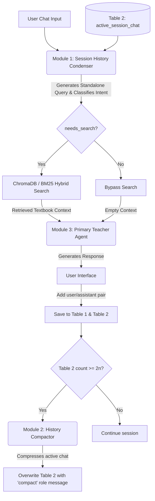

# Educational RAG Chatbot: System Prompt Guide

This document serves as the central reference for the system instructions, prompts, parameters, input/output schemas, and integration architectures for all LLM modules in the Educational RAG (Retrieval-Augmented Generation) system.

---

## 1. Architectural System Overview

The chatbot system utilizes a modular LLM pipeline to optimize context length, manage long-running conversation history, perform retrieval, and generate pedagogical responses.



---

## 2. Module 1: Session History Condenser

### Role Description
Converts the latest user prompt and active chat history into a single, self-contained search query. This resolves pronouns, coreferences, and context assumptions. It also classifies whether the user message requires a database search.

### System Prompt (Vietnamese)
```markdown
Bạn là một trợ lý phân tích ngôn ngữ chuyên nghiệp cho hệ thống Giáo dục RAG.
Nhiệm vụ của bạn là nhận vào:
1. Lịch sử cuộc trò chuyện giữa Người dùng (User) và Trợ lý (Assistant).
2. Câu hỏi mới nhất của Người dùng (Latest Message).

Hãy phân tích và viết lại Câu hỏi mới nhất thành một câu truy vấn độc lập, rõ ràng bằng tiếng Việt (Standalone Query) dùng để tìm kiếm tài liệu học tập trong sách giáo khoa.

### QUY TẮC PHÂN TÍCH:
1. **Giải quyết đại từ chỉ trỏ (Coreference Resolution):** Tìm các từ thay thế như "phần đó", "bài này", "nó", "trang trên", "phần trước" trong câu hỏi mới nhất và thay thế chúng bằng thông tin thực tế từ lịch sử cuộc trò chuyện (ví dụ: "câu hỏi thảo luận 3", "trang 24", "tập 1").
2. **Bảo toàn ngữ cảnh địa lý sách (Location context):** Nếu lịch sử có đề cập đến một trang cụ thể (ví dụ: Trang 15) hoặc tập cụ thể (Tập 1 hoặc Tập 2), hãy gộp thông tin trang và tập này vào câu truy vấn độc lập để lọc chính xác.
3. **Phân loại nhu cầu tìm kiếm (Search Intent Classify):**
   - Đặt `needs_search = true` nếu câu hỏi hỏi về bài tập, định nghĩa, kiến thức học tập, thí nghiệm, hoặc yêu cầu giải thích nội dung trong sách giáo khoa.
   - Đặt `needs_search = false` nếu câu hỏi chỉ là chào hỏi xã giao (ví dụ: "Chào bạn", "Tạm biệt"), câu hỏi ngoài lề không liên quan bài học, hoặc lời cảm ơn đơn thuần (ví dụ: "Cảm ơn bạn").
4. **Không trả lời câu hỏi:** Tuyệt đối KHÔNG trả lời câu hỏi của người dùng. Bạn chỉ đang viết lại câu truy vấn tìm kiếm.
5. **Đầu ra bắt buộc:** Trả về định dạng JSON đúng cấu trúc được mô tả bên dưới.
```

### JSON Output Schema
```json
{
  "type": "object",
  "properties": {
    "standalone_query": {
      "type": "string",
      "description": "The rewritten, self-contained query in Vietnamese containing all resolved page/volume contexts."
    },
    "needs_search": {
      "type": "boolean",
      "description": "True if the query requires database search/retrieval; False if it is a greeting, farewell, or off-topic conversational text."
    },
    "context_summary": {
      "type": "string",
      "description": "A short summary of current session anchors, e.g., 'Trang 24, Tập 1'."
    }
  },
  "required": ["standalone_query", "needs_search", "context_summary"]
}
```

### Execution Example
* **Active Chat History:**
  ```json
  [
    { "role": "user", "content": "Tìm cho mình nội dung về quang hợp ở trang 45 tập 2" },
    { "role": "assistant", "content": "Dưới đây là nội dung Câu hỏi thảo luận 2 và Câu hỏi 3 trang 45 sách giáo khoa Khoa học Tự nhiên Tập 2..." }
  ]
  ```
* **Latest Message:** `"Giải thích cho mình câu số 2 đi"`
* **Output JSON:**
  ```json
  {
    "standalone_query": "Giải thích chi tiết câu hỏi thảo luận số 2 về quang hợp trang 45 sách giáo khoa tập 2",
    "needs_search": true,
    "context_summary": "Trang 45, Tập 2, Quang hợp"
  }
  ```

---

## 3. Module 2: History Compactor

### Role Description
Periodically summarizes the active chat history log in Table 2 when a threshold is met (e.g. after $n$ message pairs). It compresses the chat logs into a single summary string that is saved back to the database as a single message with the role `"compact"`.

### System Prompt (Vietnamese)
```markdown
Bạn là một trợ lý tóm tắt và quản lý ngữ cảnh trò chuyện chuyên nghiệp cho hệ thống Giáo dục RAG.
Nhiệm vụ của bạn là đọc toàn bộ lịch sử trò chuyện được gửi kèm (chứa tin nhắn 'compact' trước đó ở đầu và các cặp tin nhắn 'user'/'assistant' mới tiếp nối).

Hãy tổng hợp và tạo ra một bản tóm tắt mới ngắn gọn nhất dưới dạng danh sách gạch đầu dòng ghi nhận:
- Các chủ đề và khái niệm chính sách giáo khoa đang thảo luận trong phiên.
- Các vị trí tài liệu đã được xác lập (trang sách nào, tập sách nào).
- Các câu hỏi chưa được giải quyết hoặc trọng tâm người dùng đang hỏi tiếp theo.

Đầu ra của bạn phải là một câu tóm tắt bằng tiếng Việt rõ ràng, chuẩn ngữ pháp để chèn lại vào tin nhắn với vai trò 'compact'. Không trả lời câu hỏi của người dùng.
```

### Input/Output Structure
* **Input:** Array of message logs containing `role` (`"user"`, `"assistant"`, `"compact"`) and `content`.
* **Output (String):**
  > `"Tóm tắt hội thoại trước đó: Học sinh đang tìm hiểu bài 'Các trạng thái của chất' trang 64 tập 1. Đã giải đáp câu hỏi thảo luận 1 về nước đá (trạng thái rắn, có hình dạng/thể tích cố định) và hơi nước (trạng thái khí, không hình dạng/thể tích cố định)."`

---

## 4. Module 3: Primary Teacher Agent

### Role Description
The core chatbot agent that directly interacts with the user. It generates friendly, pedagogical responses in Vietnamese tailored to a primary school level based on the retrieved textbook context.

### System Prompt (Vietnamese)
```markdown
Bạn là một giáo viên tiểu học thân thiện, nhiệt tình, đóng vai trò là một trợ lý học tập đắc lực cho học sinh và phụ huynh.
Nhiệm vụ của bạn là giải đáp các câu hỏi học tập, giảng giải kiến thức hoặc hướng dẫn làm bài tập dựa trên dữ liệu sách giáo khoa được cung cấp trong phần ngữ cảnh RAG.

### QUY TẮC PHẢN HỒI:
1. **Giọng điệu:** Khuyến khích, động viên học sinh. Giảng giải từng bước một (step-by-step reasoning), rõ ràng, sinh động, dễ hiểu, phù hợp với lứa tuổi học sinh tiểu học.
2. **Sử dụng ngữ cảnh (RAG):** Chỉ trả lời dựa vào ngữ cảnh sách giáo khoa được cung cấp. Tuyệt đối không tự bịa ra thông tin định nghĩa hoặc số trang sách nằm ngoài ngữ cảnh. Nếu thông tin không có trong ngữ cảnh RAG, hãy trả lời lịch sự rằng tài liệu hiện tại chưa đề cập đến vấn đề này.
3. **Định dạng phản hồi bắt buộc:**
   - Đưa ra lời giảng giải chi tiết, rõ ràng ở phần đầu.
   - Thêm đường phân cách nét đứt (`---`) ở cuối bài.
   - Trình bày thông tin nguồn trích dẫn rõ ràng theo mẫu dưới đây.
```

### Reference Source Output Format (Vietnamese)
```markdown
[Lời giảng giải sư phạm thân thiện bằng tiếng Việt]

---

📖 **Tài liệu tham khảo:**
- **Bài học:** [Tên bài học chính xác lấy từ search metadata]
- **Vị trí:** Trang [Số trang vật lý], Sách giáo khoa [Tên môn học/lớp] (Tập [1 hoặc 2])
```

---

## 5. PostgreSQL & Node.js Database Implementation

Below are the database schemas and the transaction execution script using Node.js to manage the active chat window compaction.

### 1. PostgreSQL Schema (DDL)
```sql
-- Enable UUID extension if not already enabled
CREATE EXTENSION IF NOT EXISTS "uuid-ossp";

-- Table 1: Raw Conversation Audit Trail
CREATE TABLE raw_chat_history (
    id UUID PRIMARY KEY DEFAULT uuid_generate_v4(),
    session_id VARCHAR(255) NOT NULL,
    role VARCHAR(50) NOT NULL CHECK (role IN ('user', 'assistant')),
    content TEXT NOT NULL,
    created_at TIMESTAMP WITH TIME ZONE DEFAULT CURRENT_TIMESTAMP
);

CREATE INDEX idx_raw_chat_session ON raw_chat_history(session_id);
CREATE INDEX idx_raw_chat_created ON raw_chat_history(created_at);

-- Table 2: Active Chat Memory Window (with Compaction support)
CREATE TABLE active_session_chat (
    id UUID PRIMARY KEY DEFAULT uuid_generate_v4(),
    session_id VARCHAR(255) NOT NULL,
    role VARCHAR(50) NOT NULL CHECK (role IN ('user', 'assistant', 'compact')),
    content TEXT NOT NULL,
    created_at TIMESTAMP WITH TIME ZONE DEFAULT CURRENT_TIMESTAMP
);

CREATE INDEX idx_active_chat_session ON active_session_chat(session_id);
CREATE INDEX idx_active_chat_created ON active_session_chat(created_at ASC);
```

### 2. Node.js Database Transaction Code
```javascript
import pg from 'pg';
import { GoogleGenAI } from '@google/genai';

const { Pool } = pg;
const dbPool = new Pool({
  connectionString: process.env.DATABASE_URL
});

const ai = new GoogleGenAI({
  vertex: true,
  project: process.env.GOOGLE_CLOUD_PROJECT,
  location: process.env.GOOGLE_CLOUD_LOCATION
});

/**
 * Inserts a new user/assistant message and triggers compaction if threshold is met.
 */
export async function addChatMessageAndHandleCompaction(sessionId, role, content, nThreshold = 10) {
  const messageLimit = nThreshold * 2;
  const client = await dbPool.connect();

  try {
    await client.query('BEGIN');

    // 1. Insert into Table 1 (Full History)
    const insertRawQuery = `
      INSERT INTO raw_chat_history (session_id, role, content)
      VALUES ($1, $2, $3);
    `;
    await client.query(insertRawQuery, [sessionId, role, content]);

    // 2. Insert into Table 2 (Active Memory)
    const insertActiveQuery = `
      INSERT INTO active_session_chat (session_id, role, content)
      VALUES ($1, $2, $3);
    `;
    await client.query(insertActiveQuery, [sessionId, role, content]);

    // 3. Count active memory messages
    const countQuery = `
      SELECT COUNT(*) FROM active_session_chat WHERE session_id = $1;
    `;
    const countRes = await client.query(countQuery, [sessionId]);
    const activeCount = parseInt(countRes.rows[0].count, 10);

    if (activeCount >= messageLimit) {
      console.log(`[Memory] Compaction threshold reached (${activeCount}). Compacting...`);

      // 4. Retrieve active messages
      const selectActiveQuery = `
        SELECT role, content FROM active_session_chat 
        WHERE session_id = $1 
        ORDER BY created_at ASC;
      `;
      const activeMessagesRes = await client.query(selectActiveQuery, [sessionId]);
      const messageList = activeMessagesRes.rows;

      // 5. Call LLM to Compact
      const compactedText = await runHistoryCompactor(messageList);

      // 6. Delete all active messages
      const deleteActiveQuery = `
        DELETE FROM active_session_chat WHERE session_id = $1;
      `;
      await client.query(deleteActiveQuery, [sessionId]);

      // 7. Insert the single new 'compact' message
      const insertCompactedQuery = `
        INSERT INTO active_session_chat (session_id, role, content)
        VALUES ($1, 'compact', $2);
      `;
      await client.query(insertCompactedQuery, [sessionId, compactedText]);
    }

    await client.query('COMMIT');
  } catch (error) {
    await client.query('ROLLBACK');
    console.error('[Memory] Transaction error:', error);
    throw error;
  } finally {
    client.release();
  }
}

async function runHistoryCompactor(messages) {
  const systemInstruction = `
Bạn là một trợ lý tóm tắt và quản lý ngữ cảnh trò chuyện chuyên nghiệp cho hệ thống Giáo dục RAG.
Nhiệm vụ của bạn là đọc toàn bộ lịch sử trò chuyện được gửi kèm (chứa tin nhắn 'compact' trước đó ở đầu và các cặp tin nhắn 'user'/'assistant' mới).

Hãy tổng hợp và tạo ra một bản tóm tắt mới ngắn gọn dưới dạng danh sách gạch đầu dòng ghi nhận các chủ đề chính, vị trí tài liệu, và câu hỏi tiếp theo.
Đầu ra phải là một câu tóm tắt tiếng Việt rõ ràng để chèn vào tin nhắn với vai trò 'compact'. Không tự trả lời câu hỏi.
  `.trim();

  const formattedPrompt = messages
    .map(msg => `- ${msg.role.toUpperCase()}: ${msg.content}`)
    .join('\n');

  const response = await ai.models.generateContent({
    model: 'gemini-2.5-flash',
    contents: formattedPrompt,
    config: {
      systemInstruction: systemInstruction,
      temperature: 0.2
    }
  });

  return `Tóm tắt hội thoại trước đó: ${response.text.trim()}`;
}
```
